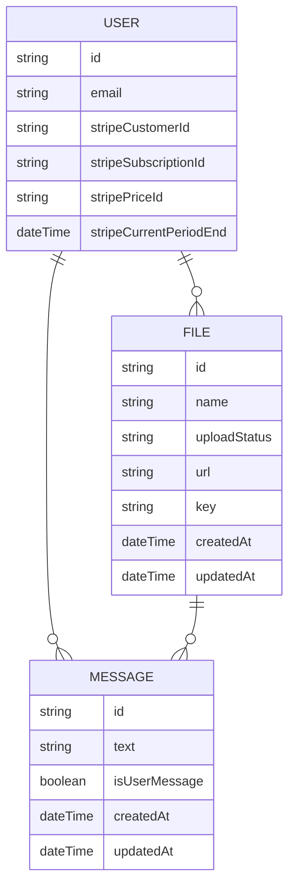

# Dokubot

Turn your Pdf-document into a robot and ask me any question about the contents!

Dokubot is a Fullstack Typescript SaaS project using Next.js 15 framework.

1. Login

2. Upload a Pdf-file

3. Start chatting

4. Upgrade plan for more features

## Table of Contents

- [Features](#features)
- [Usage](#usage)
- [Testing](#testing)
- [Tech stack](#techstack)
- [Database structure](#databaseStructure)

## Features

- Upload a Pdf-document to generate an AI robot you can ask or discuss anything about the contents.

- Documents and conversations will be stored and linked to user account for future use.

- Fast, secure and efficient payments using Stripe payments.

- infinite querying for performance and quick load.

- optimistic upload for user experience.

## Usage

- Start by install packages:

```
npm install
```

- Setup services and .env file.

1. Setup Kinde and copy enviroment variables to .env
2. Setup Uploadthing and set UPLOADTHING_API_KEY in .env
3. Setup Open AI and set OPENAI_API_KEY in .env
4. Setup Pinecone and set PINECONE_API_KEY in .env
5. Setup Stripe and set STIPE_SECRET_KEY in .env
6. Setup database, ex. PostgrSQL and set DATABASE_URL in .env

- To start project in a local server:

```bash
npm run dev
# or
yarn dev
# or
pnpm dev
# or
bun dev
```

Open [http://localhost:3000](http://localhost:3000) with your browser to see the result.

- Settings for Stripe and amount messages rendered ( Infinite query limit ) in chatbox in config folder.

## - Testing

This project uses Playwright with Typescript and POM, Page Object Model, structure.

- To run individial test file add route to file:

```bash
npx playwright test /testFile.test.ts
```

- To run tests headless:

```bash
npx playwright test
```

- To run tests headed:

```bash
npx playwright test --headed
```

- To run tests in UI-Mode for ex. time travel debugging, watch mode and more:

```bash
npx playwright test --ui
```

- To show HTML-reporter:

```bash
npx playwright test show-report
```

- To open Playwright Inspector:

```bash
npx playwright test --debug
```

## Tech stack

- NextJS
- TypeScript
- Tailwind
- Shadcn UI
- Playwright
- tRPC
- Prisma
- PostgreSQL
- Uploadthing
- Pinecone
- Open AI
- Langchain
- Stripe

## Database structure


